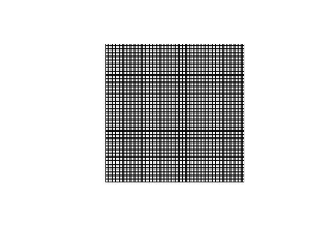

<!-- README.md is generated from README.Rmd. Please edit that file -->

# GridMaker

<!-- badges: start -->

<!-- badges: end -->

The goal of GridMaker is to produce vector GIS grid datasets of various
resolutions covering user-defined countries or regions.

``` r
knitr::include_graphics("img/demo_ex.png")
```


It is just the translation to *R* of the [Eurostat
GridMaker](https://github.com/eurostat/GridMaker) java utility that is
used by [Eurostat-GISCO](http://ec.europa.eu/eurostat/web/gisco) for the
production of [gridded
datasets](https://ec.europa.eu/eurostat/web/gisco/geodata/grids)

## Installation

You can install the development version of GridMaker from
[GitHub](https://github.com/) with:

``` r
# install.packages("pak")
pak::pak("fgoerlich/GridMaker")
```

## Example

This is a basic example which shows you how to use the function:

``` r
library(GridMaker)
GridMaker() |> sf::st_geometry() |> plot()
```


